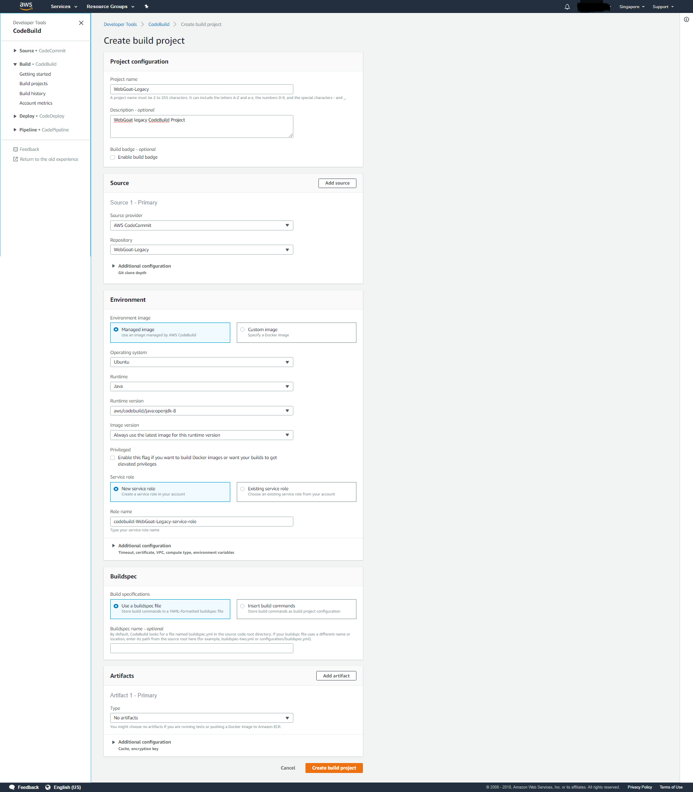
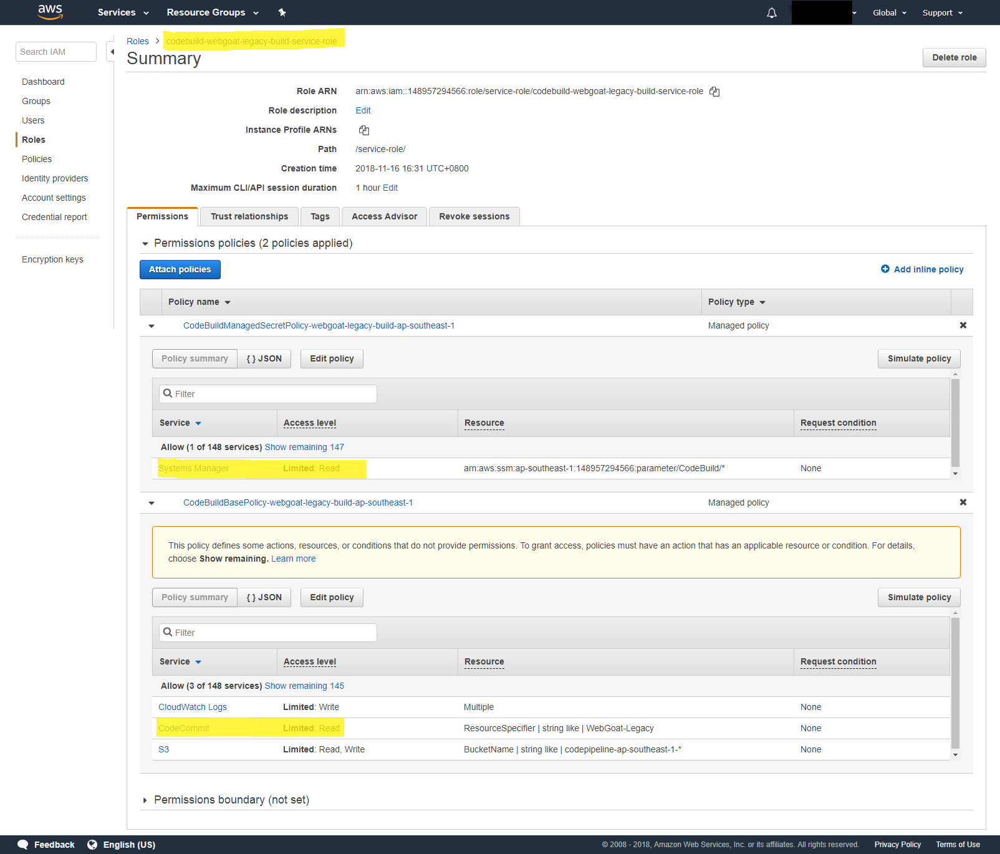
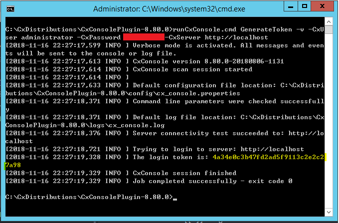
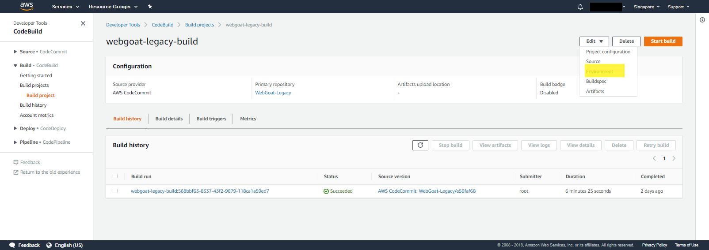
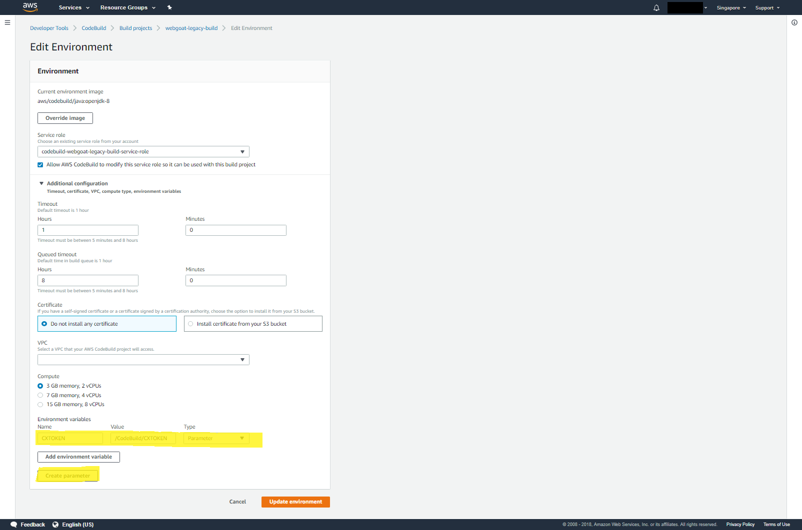
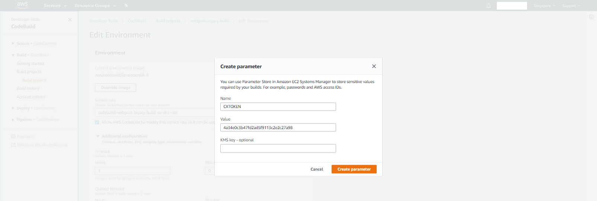
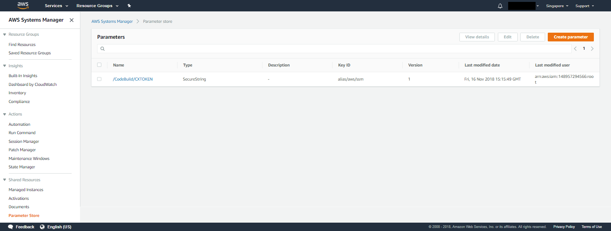
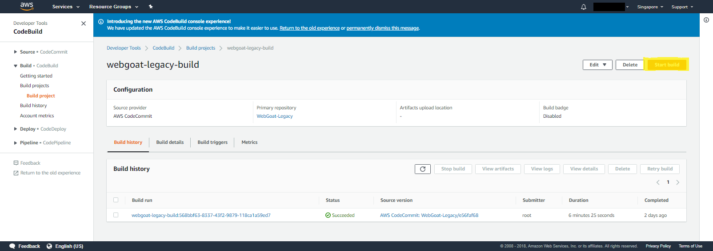
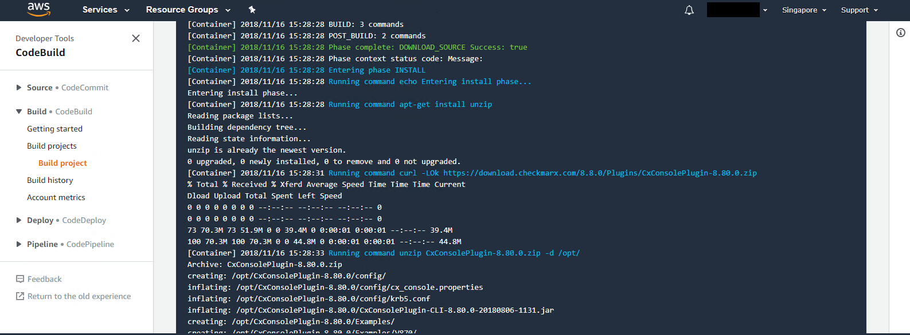
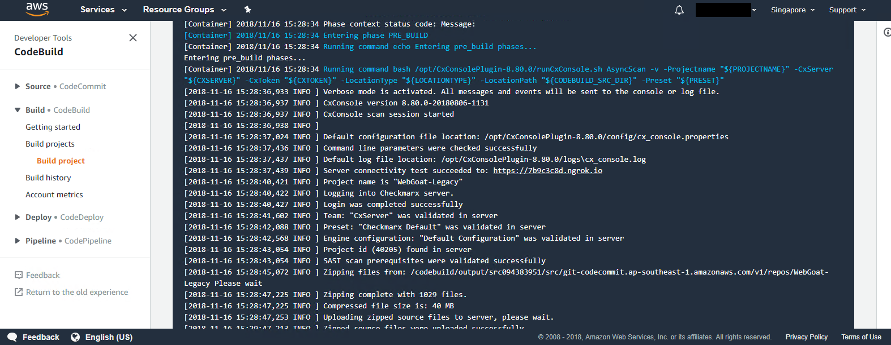

# Checkmarx CxSAST integration with AWS CodeBuild
* Author:   Pedric Kng  
* Updated:  17 Nov 2018

AWS CodeBuild offers integration through a declared build specification 'buildspec.yml' [[1]] to specify various build phases and artifacts storage.

In the build process, a container is spinned up where the source code is copied into and commands are executed according to the specifications. Checkmarx Scan will be configured as one of the command, using the Checkmarx CLI Plugin.

For discussion sake, this tutorial will be only cover Asynchronous CxSAST Scan; pipeline do not wait for scan completion. Synchronous scan, open source library scan and result handling e.g., fail on exceeded threshold, download result report can be customized using this example.

***

## Adding CxSAST within AWS CodeBuild using the console wizard

**Step1** : Create the CodeBuild project using the console wizard  


**Step2** : Setup the build as required


In this example, we will use a ubuntu container managed by AWS for the build. A customized docker machine can be used in-place, an important note is that the Checkmarx CLI Plugin requires Java(version 8 and above) and the sample buildspec file requires specific linux services i.e., apt-get, curl, unzip.

For the CodeBuild service role, do note to grant the equivalent allowed permissions as listed below;
- Read from AWS CodeCommit, required only if pulling source code from AWS CodeCommit
- Read from System Manager, this is to retrieve sensitive parameter from AWS System Manager Parameter Store



**Step3** : Add the buildspec.yml file to the root directory of your source code.

```yaml
version: 0.2

env:
  variables:
    CXSERVER: "https://7b9c3c8d.ngrok.io"
    PROJECTNAME: "CxServer\\WebGoat-Legacy"
    PRESET: "Checkmarx Default"
    LOCATIONTYPE: "folder"
  parameter-store:
    CXTOKEN: "CXTOKEN"
phases:
  install:
    commands:
      - echo Entering install phase...
      - apt-get install unzip
      - curl -LOk https://download.checkmarx.com/8.8.0/Plugins/CxConsolePlugin-8.80.0.zip
      - unzip CxConsolePlugin-8.80.0.zip -d /opt/
      - rm CxConsolePlugin-8.80.0.zip
      - chmod a+x /opt/CxConsolePlugin-8.80.0
  pre_build:
    commands:
      - echo Entering pre_build phases...
      - bash /opt/CxConsolePlugin-8.80.0/runCxConsole.sh AsyncScan -v -Projectname "${PROJECTNAME}" -CxServer "${CXSERVER}" -CxToken "${CXTOKEN}" -LocationType "${LOCATIONTYPE}" -LocationPath "${CODEBUILD_SRC_DIR}" -Preset "${PRESET}"
    finally:
      - cd $CODEBUILD_SRC_DIR
  build:
    commands:
      - echo Entering build phase...
      - echo Build started on `date`
      - mvn package
  post_build:
    commands:
      - echo Entering post_build phase...
      - echo Build completed on `date`i
```

The build specification of this example CodeBuild integration consists of two phases, namely
- **install** downloads and install the CxSAST CLI plugin
- **pre-build** executes CxSAST scan via CLI plugin

The following are environment variables that is configured with the sample, do note that variables can be displayed in plain text using tools such as the AWS CodeBuild console.  

AWS offers a securestring variant 'Parameter' that is protected by the AWS System Manager Parameter store. It is recommended to protect sensitive values e.g., CxSAST Authentication Token with this mechanism. [[2]]

| Name          | Type          | Description         |
| ------------- |---------------|---------------------|
| CXSERVER      | Plaintext     | CxSAST URL          |
| PROJECTNAME   | Plaintext     | CxSAST project name |
| PRESET        | Plaintext     | Scan Preset e.g., Checkmarx Default         |
| LOCATIONTYPE  | Plaintext     | Location type i.e., folder       |
| CXTOKEN       | Parameter     | CxSAST Auth Token [[3]] |
**Note** : Variable name starting with 'CODEBUILD_' are reserved for AWS CodeBuild internal use, they should not be used in your build commands

**Step4** : Generate Checkmarx CLI Authentication Token
The plugin will use Token-based authentication for verification, follow the instructions in [[3]] to generate the token.


**Step5** : Edit the environment variables of the CodeBuild project


Under additional configuration, add a new Parameter named 'CXTOKEN', this is to store the CxSAST CLI Auth token.



The token will be valid till revoked[[3]], should a change be required. It can be done through the AWS System Manager > Parameter Store


**Step6** : Start a build


**Step7**: Observe the CLI plugin installation and start Async scan in logs

INSTALL Stage


PRE_BUILD Stage


<!--
## Adding CxSAST within AWS CodeBuild using the AWS CLI
_IN WORKS_
-->

## References
Build Specification Reference for AWS CodeBuild [[1]]  
Environment Variables in AWS CodeBuild [[2]]  
Authentication / Login to the CxSAST/CxOSA CLI [[3]]  

[1]:https://docs.aws.amazon.com/codebuild/latest/userguide/build-spec-ref.html#build-spec-ref-syntax "Build Specification Reference for AWS CodeBuild"  
[2]:https://docs.aws.amazon.com/codebuild/latest/userguide/build-env-ref-env-vars.html "Environment Variables in CodeBuild"  
[3]:https://checkmarx.atlassian.net/wiki/spaces/KC/pages/222232891/Authentication+Login+to+the+CxSAST+CxOSA+CLI "Authentication / Login to the CxSAST/CxOSA CLI"


<!--

***

## Troubleshooting

### Connecting to AWS CodeCommit using username and Password
Refer to [[5]]

### Connecting to AWS CodeCommit using aws cli credentials helper (not working)
1. Validate that you have followed [[1]] to setup the AWS Command; note that Python 3.6 and pip is required.
2. Setup a 'CodeCommitProfile' profile in "%user_profile%\\.aws\\credentials"

```yaml
[default]

[CodeCommitProfile]
aws_access_key_id = *AWS ACCESS KEY*
aws_secret_access_key = *AWS SECRET ACCESS KEY*
```
3. Configure additional credential in "%user_profile%\\.gitconfig" for AWS CodeCommit, give the credential a particular domain setting. This can prevent it from overriding other GIT credential e.g., Windows Credential for GitHub.

```yaml
[gui]
[user]
	email = abc@gmail.com
	name = abc
[credential]
    helper = wincred
[credential "https://git-codecommit.*.amazonaws.com"]
	helper = !aws --profile CodeCommitProfile codecommit credential-helper $@
	UseHttpPath = true
```
Referenced from blog [[4]]

## References

Install the AWS Command Line Interface on Microsoft Windows [[1]]  
AWS CLI Name Profile Configuration [[2]]  

Using CodeCommit and Github credentials [[4]]
Introducing Git Credentials: A Simple Way to Connect to AWS CodeCommit Repositories Using a Static User Name and Password [[5]]

[1]:https://docs.aws.amazon.com/cli/latest/userguide/awscli-install-windows.html#awscli-install-windows-path "Install the AWS Command Line Interface on Microsoft Windows"
[2]:https://docs.aws.amazon.com/cli/latest/userguide/cli-multiple-profiles.html "AWS CLI Name Profile Configuration"

[4]:https://jameswing.net/aws/using-codecommit-and-git-credentials.html "Using CodeCommit and Github credentials"
[5]:https://aws.amazon.com/blogs/devops/introducing-git-credentials-a-simple-way-to-connect-to-aws-codecommit-repositories-using-a-static-user-name-and-password/ "Introducing Git Credentials: A Simple Way to Connect to AWS CodeCommit Repositories Using a Static User Name and Password"

-->
