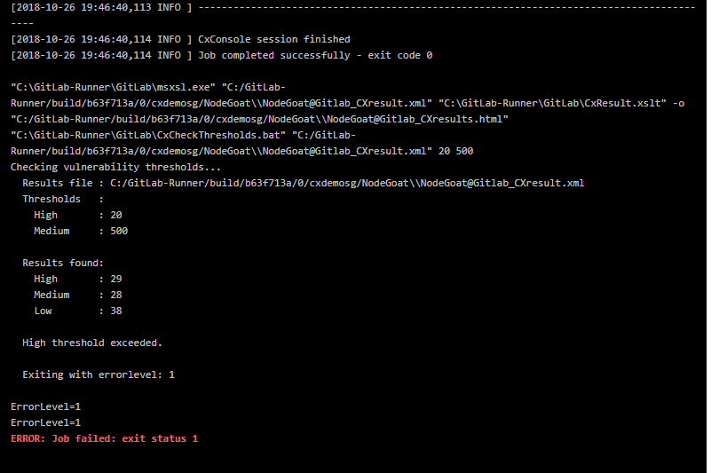

# GitLab CI Shell Runner with CxSAST
* Author:   Pedric Kng  
* Updated:  26 Oct 2018

The purpose of this project is to share GitLab CI Shell Runner integration  with Checkmarx CxSAST to perform SAST scan during the test stage.

***
## Step by step
1. Setup [GitLab Shell Runner](https://docs.gitlab.com/runner/install/windows.html)
2. Install the [Checkmarx CLI tool](https://www.checkmarx.com/plugins/), note that this example has been tested with v8.9.0 version of the tool.
3. Download the following files to your machine installed with the runners and edit accordingly.  
[msxml.exe](cx/msmxl.exe) -- xml parser  
[CxCheckThresholds.bat](cx/CxCheckThresholds.bat) -- Script to check for severity thresholds in the result  
[CxResult.xslt](cx/CxCheckThresholds.bat) -- xslt to parse the XML scan result  
[Cx_GitLab_Windows_demo.bat](cx/Cx_GitLab_Windows_demo.bat) -- Script to execute scans and parse the XML scan result.  

| Arguments     | Description               |
| ------------- |---------------------------|
| -p            | Checkmarx scan preset     |
| -h            | high severity threshold   |
| -m            | medium severity threshold |

4. Edit the [Cx_GitLab_Windows_demo.bat](cx/Cx_GitLab_Windows_demo.bat) accordingly i.e., Checkmarx CxSAST authentication credentials, parameters, CLI path.

5. Create a file named [.gitlab-ci.yml](cx/.gitlab-ci.yml) in the root directory of your repository, edit as required.

  ```yml
  # .gitlab-ci.yml
  # Take note that yml file only accepts space character, tab is not supported
  variables:
    GIT_SUBMODULE_STRATEGY: recursive

  before_script:

  stages:
    - test

  cxsast:
    stage: test
    script:
     - call C:\GitLab-Runner\GitLab\Cx_GitLab_Windows_demo.bat -h 20 -m 500

    only:
      - master
    tags:
      - windows

  ```
6. Push to your GitLab repository
7. Execute your GitLab pipeline, should the threshold exceed. The job should fail.



***
## Known issues with GitLab Shell Runner
- [Character '!' is removed when script executing in GitLab Shell Runner](https://gitlab.com/gitlab-org/gitlab-runner/issues/1864), there is currently no workaround.  
- [SSL certificate verification not working in version 10.6](https://gitlab.com/gitlab-org/gitlab-runner/issues/3180), a simple workaround is to add an environmental variable: "GIT_SSL_NO_VERIFY=true" to your runner's configuration.

```toml
# config.toml
concurrent = 1
check_interval = 0

[session_server]
  session_timeout = 1800

[[runners]]
  name = "win-gitlab-runner"
  url = "https://gitlab.com/"
  token = "****"
  executor = "shell"
  builds_dir = "C:\\GitLab-Runner\\build"
  cache_dir = "C:\\GitLab-Runner\\cache"
  environment = ["GIT_SSL_NO_VERIFY=1"]
  [runners.cache]
    [runners.cache.s3]
    [runners.cache.gcs]
```

- Path separator '\' is differently interpreted as executed in GitLab Runner, there might be a need to use double path separator '\\\\' in some case.
- For shell runner in Windows environment, the script runs in the windows temporary directory.

## References

Getting started with GitLab CI/CD [[1]]  
GitLab CI/CD Variables [[2]]  
GitLab Runner Advanced Configuration [[3]]  
Introduction to GitLab CI pipelines and jobs [[4]]

[1]:https://docs.gitlab.com/ce/ci/quick_start/README.html "Getting started with GitLab CI/CD"
[2]:https://docs.gitlab.com/ee/ci/variables/#gitlab-ci-yml-defined-variables "GitLab CI/CD Variables"
[3]:https://docs.gitlab.com/runner/configuration/advanced-configuration.html "Gitlab Runner Advanced Configuration"
[4]:https://docs.gitlab.com/ee/ci/pipelines.html "Introduction to GitLab CI pipelines and jobs"
